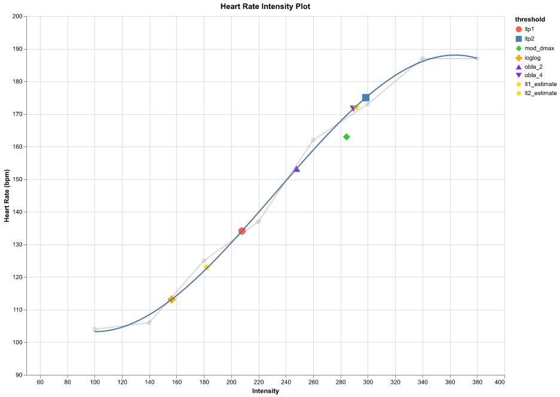
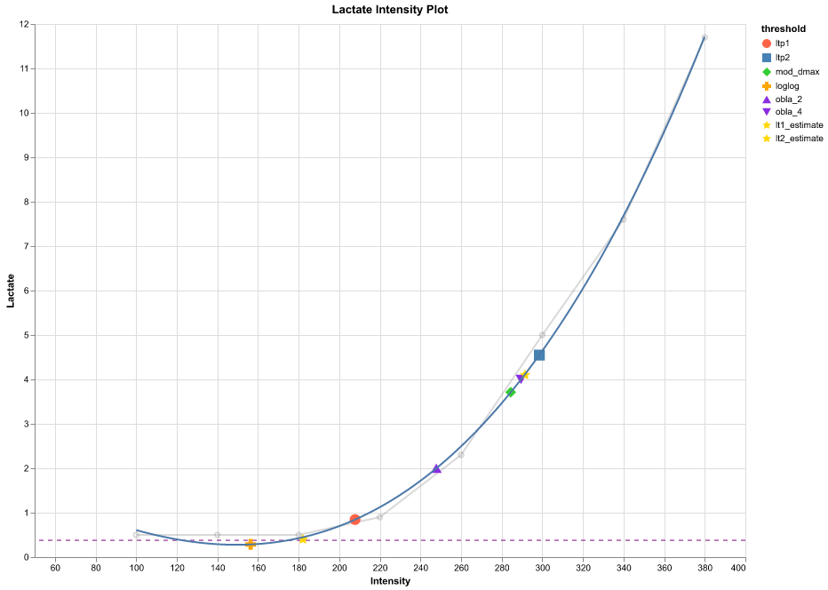

# Lactate thresholds and zones

Repo to use python library [lactate-thresholds](https://github.com/bart6114/lactate-thresholds) to calculate thresholds and zones.

Clone this repository:

```zsh
git clone https://github.com/cast42/lactaat.git
```

Adapt your measurements in file [lactate_report.py](lactate_report.py)

Run the python program lactaat.py:

```zsh
uv run python lactaat.py
```

Output:

```ascii
➜  lactaat git:(main) ✗ uv run python lactate_report.py
                                  Measurement input
┏━━━━━━┳━━━━━━━━━━━┳━━━━━━━━━━━━━━━━━━┳━━━━━━━━━━━━┳━━━━━━━━━┳━━━━━━┳━━━━━━┳━━━━━━━━┓
┃ time ┃ intensity ┃ intensity per kg ┃ heart_rate ┃ lactate ┃ rpm  ┃ step ┃ length ┃
┡━━━━━━╇━━━━━━━━━━━╇━━━━━━━━━━━━━━━━━━╇━━━━━━━━━━━━╇━━━━━━━━━╇━━━━━━╇━━━━━━╇━━━━━━━━┩
│ 10.0 │ 100.0     │ 1.07             │ 104.0      │ 0.5     │ 83.0 │ 1.0  │ 3.0    │
│ 13.0 │ 140.0     │ 1.5              │ 106.0      │ 0.5     │ 83.0 │ 2.0  │ 3.0    │
│ 16.0 │ 180.0     │ 1.93             │ 125.0      │ 0.5     │ 84.0 │ 3.0  │ 3.0    │
│ 19.0 │ 220.0     │ 2.36             │ 137.0      │ 0.9     │ 86.0 │ 4.0  │ 3.0    │
│ 22.0 │ 260.0     │ 2.79             │ 162.0      │ 2.3     │ 84.0 │ 5.0  │ 3.0    │
│ 25.0 │ 300.0     │ 3.22             │ 173.0      │ 5.0     │ 88.0 │ 6.0  │ 3.0    │
│ 28.0 │ 340.0     │ 3.65             │ 187.0      │ 7.6     │ 83.0 │ 7.0  │ 3.0    │
│ 31.0 │ 380.0     │ 4.08             │ 187.0      │ 11.7    │ 66.0 │ 8.0  │ 3.0    │
└──────┴───────────┴──────────────────┴────────────┴─────────┴──────┴──────┴────────┘
lpt1
LactateTurningPoint(lactate=0.8456130923641281, intensity=207.78800877530173, heart_rate=134.06313034411033)
lpt2
LactateTurningPoint(lactate=4.548786226629117, intensity=298.5180801781001, heart_rate=174.99866360071974)
lt2_estimate
ThresholdEstimate(lactate=0.4, intensity=182.1, heart_rate=123.0)
lt2_estimate
ThresholdEstimate(lactate=4.1, intensity=291.5, heart_rate=172.0)

                                                         Seiler 3 zones
┏━━━━━━━━┳━━━━━━━━━━━━━━━━━┳━━━━━━━━━━━━┳━━━━━━━━━━━━━━━━━━━━━━━━━━━━━━━━━━━━━━━━━━━━━━━━━━━━━━━━━━━━━━━━━━━━━━━━━━━━━━━━━━━━━━━┓
┃ zone   ┃ intensity       ┃ heart_rate ┃ focus                                                                                 ┃
┡━━━━━━━━╇━━━━━━━━━━━━━━━━━╇━━━━━━━━━━━━╇━━━━━━━━━━━━━━━━━━━━━━━━━━━━━━━━━━━━━━━━━━━━━━━━━━━━━━━━━━━━━━━━━━━━━━━━━━━━━━━━━━━━━━━┩
│ Zone 1 │ 0.00 - 182.10   │ up to 123  │ Recovery, building an aerobic foundation.                                             │
│ Zone 2 │ 182.10 - 291.50 │ 123 - 172  │ Moderate aerobic work; a gray zone with limited efficiency for endurance adaptations. │
│ Zone 3 │ 291.50 - max    │ 172 - max  │ Enhancing anaerobic threshold and lactate tolerance.                                  │
└────────┴─────────────────┴────────────┴───────────────────────────────────────────────────────────────────────────────────────┘

                                         Seiler 5 zones
┏━━━━━━━━┳━━━━━━━━━━━━━━━━━┳━━━━━━━━━━━━┳━━━━━━━━━━━━━━━━━━━━━━━━━━━━━━━━━━━━━━━━━━━━━━━━━━━━━━┓
┃ zone   ┃ intensity       ┃ heart_rate ┃ focus                                                ┃
┡━━━━━━━━╇━━━━━━━━━━━━━━━━━╇━━━━━━━━━━━━╇━━━━━━━━━━━━━━━━━━━━━━━━━━━━━━━━━━━━━━━━━━━━━━━━━━━━━━┩
│ Zone 1 │ 0 - 178.46      │ up to 121  │ Recovery, building an aerobic foundation.            │
│ Zone 2 │ 178.46 - 185.74 │ 121 - 124  │ Aerobic base building and improving fat utilization. │
│ Zone 3 │ 185.74 - 285.67 │ 124 - 170  │ Aerobic endurance and muscular efficiency.           │
│ Zone 4 │ 285.67 - 297.33 │ 170 - 175  │ Improving lactate tolerance and anaerobic threshold. │
│ Zone 5 │ 297.33 - max    │ 175 - max  │ Anaerobic capacity, speed, and power.                │
└────────┴─────────────────┴────────────┴──────────────────────────────────────────────────────┘

                                         Friel 7 zones running
┏━━━━━━━━━━━━━━━━━━━━━━━━━━━━━┳━━━━━━━━━━━━━━━━━━┳━━━━━━━━━━━━┳━━━━━━━━━━━━━━━━━━━━━━━━━━━━━━━━━━━━━━━━┓
┃ zone                        ┃ intensity        ┃ heart_rate ┃ focus                                  ┃
┡━━━━━━━━━━━━━━━━━━━━━━━━━━━━━╇━━━━━━━━━━━━━━━━━━╇━━━━━━━━━━━━╇━━━━━━━━━━━━━━━━━━━━━━━━━━━━━━━━━━━━━━━━┩
│ Zone 1. Recovery            │ up to 233.20     │ 0 - 146    │ Active recovery.                       │
│ Zone 2. Aerobic             │ 233.20 - 247.50  │ 146 - 153  │ Aerobic endurance.                     │
│ Zone 3. Tempo               │ 251.20 - 266.00  │ 155 - 162  │ Building aerobic capacity and stamina. │
│ Zone 4. SubThreshold        │ 269.90 - 286.10  │ 163 - 170  │ Threshold effort.                      │
│ Zone 5a. VO2 SuperThreshold │ 290.50 - 299.70  │ 172 - 175  │ Improving VO2 max.                     │
│ Zone 5b. Aerobic Capacity   │ 304.70 - 322.00  │ 177 - 182  │ Anaerobic capacity.                    │
│ Zone 5c. Anaerobic Capacity │ more than 322.00 │ 182 - max  │ Peak power output.                     │
└─────────────────────────────┴──────────────────┴────────────┴────────────────────────────────────────┘
```

Heart rate intensity plot:



Lactate intensity plot:


